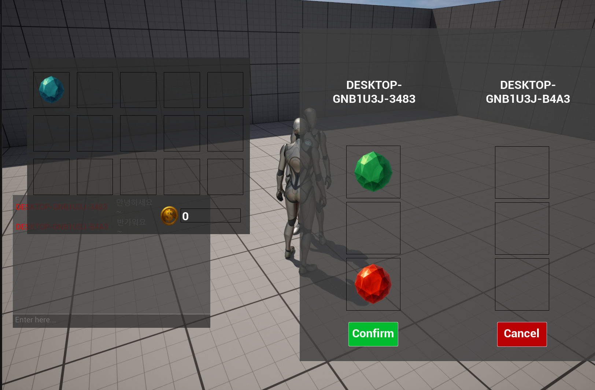
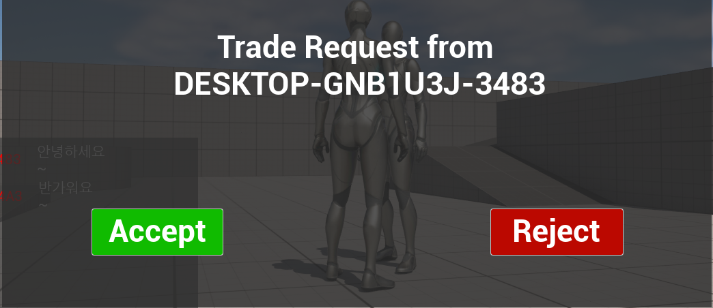
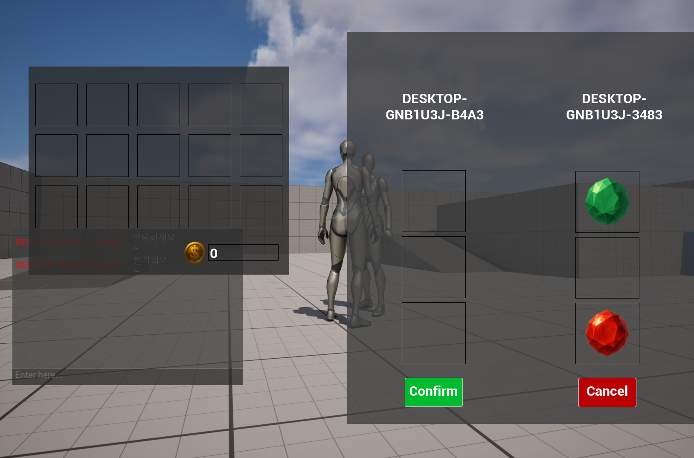
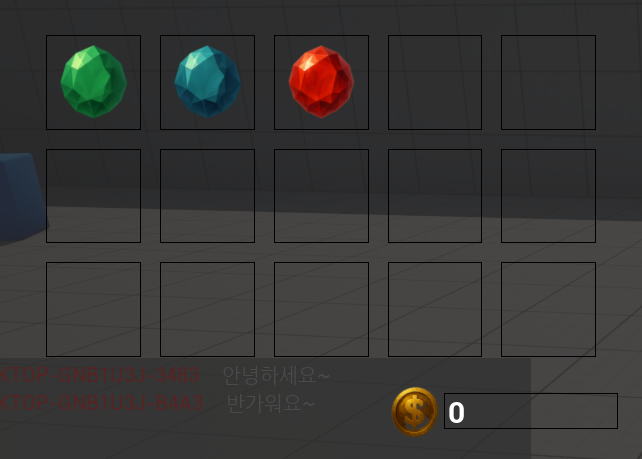
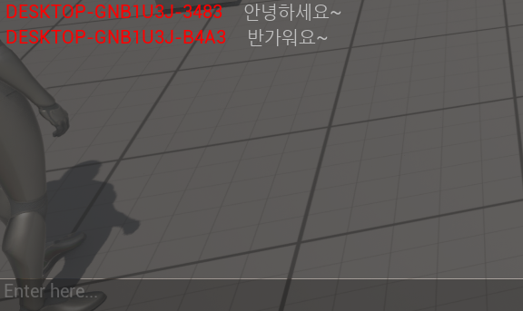

# Unreal Engine 5 멀티플레이어 게임 시스템


> **데디케이티드 서버 아키텍처** 기반 멀티플레이어 게임  
> 서버 권한 검증으로 안전한 실시간 채팅, 아이템 거래, 인벤토리 관리 시스템 구현

<!-- 📸 메인 게임 스크린샷 -->


**[게임 플레이 영상 보기](https://youtu.be/WuXey4O_E2o)**

---

## 프로젝트 소개

Unreal Engine 5로 개발한 멀티플레이어 게임 시스템입니다. Listen Server가 아닌 **독립 서버 방식**으로 모든 게임 로직을 서버에서 검증하여 치팅을 원천 차단했습니다.

- **개발 기간**: 2025.01 ~ 2025.05
- **개발 인원**: 1인 개발
- **Unreal Engine**: 5.3

---

## 게임 플레이

### 주요 기능

- **실시간 채팅**: 멀티플레이어 채팅 (메시지 검증)
- **안전한 거래**: 플레이어 간 아이템 교환 (서버 권한)
- **인벤토리 관리**: 드래그 앤 드롭 아이템 이동
- **아이템 드롭**: 월드에 아이템 배치 및 자동 픽업

### 네트워크 구조

```
          [Dedicated Server]
         (Game Logic Authority)
                 ↓↑
    ┌────────────┼────────────┐
    ↓            ↓            ↓
[Client A]   [Client B]   [Client C]
```

---

## 핵심 시스템

### 1. 거래 시스템

<!-- 📸 거래 UI 스크린샷 -->




Server Authority 패턴으로 안전한 아이템 교환

- 거래 요청 → 수락 → 아이템 배치 → 양측 확인 → 실행
- **에러 처리**: 연결 끊김 감지 시 자동 취소 및 아이템 반환
- **공간 검증**: 인벤토리 가득 찬 경우 거래 사전 차단
- **실시간 동기화**: Multicast RPC로 거래 상태 업데이트

```cpp
// 거래 실행 (서버 권한)
void ATradeManager::ExecuteTrade()
{
    if (!HasAuthority()) return;
    
    // 연결 상태 검증
    if (!ControllerA || !ControllerB) {
        CancelTrade();  // 아이템 반환
        return;
    }
    
    // 인벤토리 공간 검증
    if (InvA->GetAvailableSlots() < RequiredSlots) {
        CancelTrade();
        return;
    }
    
    // 거래 실행...
}
```

### 2. 인벤토리 시스템

<!-- 📸 인벤토리 UI 스크린샷 -->


조건부 리플리케이션으로 개인 정보 보호

- **COND_OwnerOnly**: 타 플레이어에게 인벤토리 정보 노출 방지
- **Server RPC Validation**: 모든 아이템 조작 서버 검증
- **드래그 앤 드롭**: UMG DragDropOperation 활용
- **자동 동기화**: Replication으로 UI 자동 업데이트

```cpp
// 소유자에게만 리플리케이션 (보안)
void UInventoryComponent::GetLifetimeReplicatedProps(
    TArray<FLifetimeProperty>& OutLifetimeProps) const
{
    DOREPLIFETIME_CONDITION(UInventoryComponent, Inventory, COND_OwnerOnly);
}

// 서버 검증
bool ServerAddItem_Validate(const FItemData& ItemData)
{
    if (!ItemData.IsValid()) return false;
    if (ItemData.ItemID < 0 || ItemData.ItemID > 1000) return false;
    if (Inventory.Num() >= 20) return false;
    return true;
}
```

### 3. 채팅 시스템

<!-- 📸 채팅 UI 스크린샷 -->


Server → Multicast 브로드캐스트

- **메시지 검증**: 빈 메시지, 200자 초과 차단
- **송신자 표시**: 각 메시지에 플레이어 이름
- **입력 모드 전환**: 채팅 중 게임 입력 비활성화

```cpp
UFUNCTION(Server, Reliable, WithValidation)
void ServerSendMessage(const FString& Message);

bool ServerSendMessage_Validate(const FString& Message)
{
    return !Message.IsEmpty() && Message.Len() <= 200;
}
```

### 4. 네트워크 최적화

**Custom Serialization으로 대역폭 절감**

```cpp
// Before: 전체 FItemData 전송 (~200 bytes)
struct FItemData {
    int32 ItemID;           // 4 bytes
    FString ItemName;       // ~50 bytes
    UTexture2D* ItemIcon;   // ~150 bytes
};

// After: ItemID만 전송 (4 bytes)
bool FTradeState::NetSerialize(FArchive& Ar, ...) {
    Ar << Item.ItemID;  // 4 bytes만 전송
    
    // 수신 측에서 Database로 복원
    if (Ar.IsLoading()) {
        Item = UItemDatabase::GetInstance()->GetItemData(Item.ItemID);
    }
}
```

---

## 기술 스택

### 개발 환경
- **엔진**: Unreal Engine 5.3
- **언어**: C++ (Core Logic) + Blueprint (UI/Content)

### 네트워킹
- Dedicated Server 아키텍처
- RPC (Server/Client/Multicast)
- Property Replication (Conditional)
- Custom Serialization

### 설계 패턴
- Server Authority 패턴
- Component 기반 설계
- Singleton 패턴 (ItemDatabase)
- Event-driven Architecture (Delegate)

### 구현 기술
- Enhanced Input System
- UMG (Unreal Motion Graphics)
- Server RPC Validation
- Conditional Replication (COND_OwnerOnly)

---

## 프로젝트 구조

```
Source/Multiplay/
├── Characters/
│   └── MultiplayCharacter       # 플레이어 캐릭터
├── Controllers/
│   └── MultiplayerController    # 입력, UI 관리
├── Chatting/
│   └── PlayerChatComponent      # 채팅 시스템
├── Inventory/
│   ├── InventoryComponent       # 인벤토리 관리
│   ├── InventoryTypes           # 아이템 데이터 구조
│   └── ItemDatabase             # 아이템 DB
├── Trading/
│   ├── TradeComponent           # 거래 요청/응답
│   ├── TradeManager             # 거래 세션 관리
│   └── TradeState               # 거래 상태
└── UI/
    ├── ChatWidget               # 채팅 UI
    ├── InventoryWidget          # 인벤토리 UI
    └── TradeWidget              # 거래 UI
```

---

## 설치 및 실행

### 필요 조건
- Unreal Engine 5.3 이상 (source build)
- Visual Studio 2022 (Windows)
- Git

### 개발 환경 설정

```bash
# 1. 저장소 클론
git clone https://github.com/minsforgh/dedicated-server-interaction
cd multiplay-ue5

# 2. .uproject 파일 우클릭
# → "Generate Visual Studio project files" 선택

# 3. Visual Studio에서 솔루션 열기
# → 빌드 (Ctrl+Shift+B)
```

### 멀티플레이어 테스트

**방법 1: 에디터에서 간단 테스트**
1. 에디터 상단 **Play** 버튼 옆 드롭다운 클릭
2. **Number of Players**: 2 이상 설정
3. **Net Mode**: Play As Listen Server (테스트 목적)
4. **Play** 클릭

**방법 2: 데디케이티드 서버 테스트**
1. 프로젝트 패키징 (Shipping 또는 Development Server)
2. 서버 실행: `Multiplay.exe -server -log`
3. 클라이언트 실행: `Multiplay.exe -game`
4. 콘솔에서 접속: `open 127.0.0.1`

---

## 개발 하이라이트

### 보안 중심 설계
- **Server RPC Validation**: 모든 클라이언트 요청 검증
- **조건부 리플리케이션**: 개인 정보 보호 (COND_OwnerOnly)
- **에러 처리**: 거래 중 연결 끊김, 인벤토리 가득참 대응

### 데디케이티드 서버 아키텍처
- **Server Authority**: 모든 게임 로직을 서버에서 실행
- **치팅 방지**: 클라이언트 조작 불가능한 구조
- **확장 가능**: MMO, Battle Royale 등으로 확장 가능

### 네트워크 최적화
- **Custom Serialization**: 대역폭 98% 절감
- **Conditional Replication**: 필요한 데이터만 전송
- **Reliable RPC**: 중요 데이터 패킷 손실 방지

---

## 라이선스

이 프로젝트는 학습 목적으로 제작되었습니다.

---

## 연락처

- **GitHub**: [@minsforgh](https://github.com/minsforgh)
- **Email**: minsfor@gmail.com